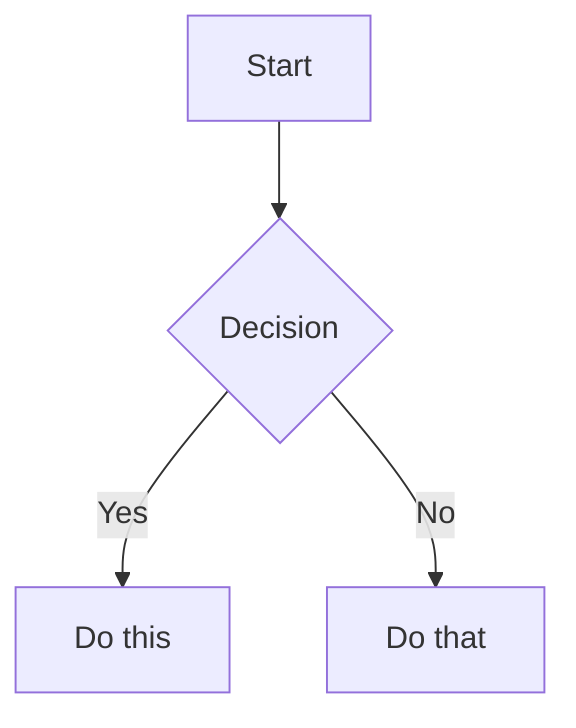

# Academic Homepage + Blog · Astro

A clean, typography-driven academic personal homepage and blog built with [Astro 5](https://astro.build). Designed in the **Editorial Minimalism** style — serif headlines, generous whitespace, no card UI. Inspired by Anthropic's engineering blog and _The New Yorker_.

**[Live Demo](https://zhouzenghui.site)**

---

## Quick Start (5 minutes to your own site)

1. **Fork this repo**
2. **Edit `src/config.ts`** — change your name, avatar, social links, site URL
3. **Replace `public/images/profile.jpg`** with your photo
4. **Edit `src/pages/about.astro`** — update your bio, education, publications, experience
5. **Add blog posts** to `src/content/blog/` (Markdown with frontmatter)
6. **Push to `main`** — GitHub Actions deploys to GitHub Pages automatically

---

## Features

### Design
- **Editorial Minimalism** — typography-first, no cards, no background colors
- **Newsreader serif font** for names, titles, body text; **Inter sans-serif** for metadata
- **5-level typographic scale** — 32px → 18px → 16px → 14px → 12px
- **Dual-column table-row layout** on the About page (label + content)
- **Micro-capsule badges** for journals, roles, honors (restrained borders, no saturated colors)
- **Responsive** — single breakpoint at 768px, stacks gracefully on mobile

### Blog
- **Editorial blog list** — featured post as newspaper front-page headline, recent posts as table rows
- **Serif article body** — 18px Newsreader, 1.8 line-height, paragraph rhythm
- **Auto-generated Table of Contents** — sticky left sidebar on desktop
- **KaTeX math** — `$E = mc^2$` and `$$...$$` block formulas
- **Mermaid diagrams** — ` ```mermaid ` code blocks rendered client-side
- **Giscus comments** — optional, configure in `config.ts`

### Engineering
- **Single config file** — `src/config.ts` controls everything
- **Google Scholar citations** — auto-fetched via CDN, displayed per-paper
- **RSS feed** — auto-generated from blog posts
- **GitHub Pages deployment** — push to `main`, GitHub Actions handles the rest
- **Zero runtime JS** (except citation count + Giscus + Mermaid)

---

## Project Structure

```
src/
├── config.ts                    ★ Your one-file configuration
├── content/
│   └── blog/                    Blog posts (Markdown with frontmatter)
├── components/
│   ├── AboutCard.astro          Avatar + social links
│   ├── Badge.astro              Micro-capsule labels
│   ├── BlogToc.astro            Auto-generated table of contents
│   ├── CitationCount.astro      Google Scholar citation badge
│   ├── Giscus.astro             Comment system
│   ├── Header.astro / Footer.astro
│   ├── Hero.astro               Homepage hero section
│   └── Section.astro            Generic section wrapper
├── layouts/
│   ├── BaseLayout.astro         HTML shell + SEO + fonts
│   └── BlogPostLayout.astro     Blog article with TOC sidebar
├── pages/
│   ├── index.astro              Homepage
│   ├── about.astro              Full CV / about page
│   └── blog/
│       ├── index.astro          Blog listing
│       └── [...slug].astro      Blog article
├── styles/
│   └── global.css               Complete design system
└── icons/                       SVG icon components
public/
├── images/                      Profile photo, favicon
└── CNAME                        Custom domain (optional)
```

---

## Writing Blog Posts

Create `.md` files in `src/content/blog/` named `YYYY-MM-DD-slug.md`:

```markdown
---
title: "How I Think About LLM Testing"
date: 2025-05-28
excerpt: "A framework for reasoning about the reliability of LLMs."
keywords: ["LLM Testing", "Metamorphic Testing", "AI Safety"]
related: []
featured: true
draft: false
---

Your content here. 

## Math via KaTeX

Inline: $E = mc^2$

Block: $$f(x) = \sum_{i=0}^n \frac{x^i}{i!}$$

## Diagrams via Mermaid


```

### Frontmatter fields

| Field | Required | Description |
|-------|----------|-------------|
| `title` | ✅ | Post title |
| `date` | ✅ | `YYYY-MM-DD` |
| `excerpt` | — | Short preview for lists and SEO |
| `keywords` | — | Array of tags |
| `related` | — | Slugs of related posts |
| `featured` | — | `true` = show as newspaper headline on blog page |
| `draft` | — | `true` = skip during build |

---

## Configuration

All customization in `src/config.ts`:

```typescript
export const site = {
  title: "Your Name",
  description: "PhD Candidate at ...",
  url: "https://yourname.github.io",
  lang: "en",
  analyticsId: "G-XXXXXXXXXX",  // optional Google Analytics
};

export const author = {
  name: "Your Name (中文名)",
  avatar: "/images/profile.jpg",
  bio: "Your University",
  location: "City, Country",
  email: "...",
  github: "...",
  googleScholar: "...",
  orcid: "...",
  // ...
};

export const navigation = {
  header: [
    { label: "Intro", href: "/about" },
    { label: "Blog", href: "/blog" },
  ],
};

export const homePage = {
  greeting: "Hi, I'm ...",
  subtitle: "...",
  keywords: [...],
};

export const giscus = {
  repo: "your/repo",
  repoId: "...",
  category: "Blog Comments",
  categoryId: "...",
};
```

---

## Customizing the About Page

Edit `src/pages/about.astro` directly. The page uses these components:

- `<Section title="...">` — section wrapper with heading
- `<Badge variant="journal|role|honor|project">` — micro-capsule labels
- `<CitationCount paperId="...">` — auto-fetched citation count

Each section follows a consistent dual-column pattern:

```html
<div class="cv-row">
  <span class="cv-label edu-date">2020 – 2023</span>
  <div>
    <div class="cv-main">Your degree or title</div>
    <div class="cv-desc">Description text</div>
  </div>
</div>
```

---

## Google Scholar Citations

1. The `google_scholar_crawler/` directory contains a Python script
2. GitHub Actions (`google_scholar_crawler.yaml`) runs it periodically
3. Citation data is stored in the `google-scholar-stats` branch
4. Served via jsDelivr CDN — no server needed
5. The site fetches it client-side and displays per-paper counts

**Setup:** Update `USER_ID` in the crawler script to your Google Scholar user ID.

---

## Local Development

```bash
npm install
npm run dev          # http://localhost:4321
npm run build        # Production build to dist/
```

---

## Deploy

Push to `main`. GitHub Actions builds and deploys to GitHub Pages automatically.

For a custom domain:
1. Edit `public/CNAME` with your domain
2. Configure your DNS (CNAME to `<username>.github.io`)

---

## Design Principles

This template follows strict editorial design rules:

1. **No cards** — no background colors, no border-radius, no box-shadows on content
2. **Binary font system** — serif (Newsreader) for content, sans-serif (Inter) for metadata
3. **5-level scale** — 32/18/16/14/12px, each with a clear role
4. **Full-width black lines** — split sections at the page level, never between items
5. **Hover is color only** — no scale, no shadow, no background change
6. **Left-aligned** — no centering, left edge is the spine

---

## License

MIT
