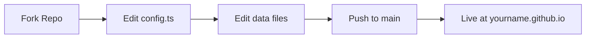
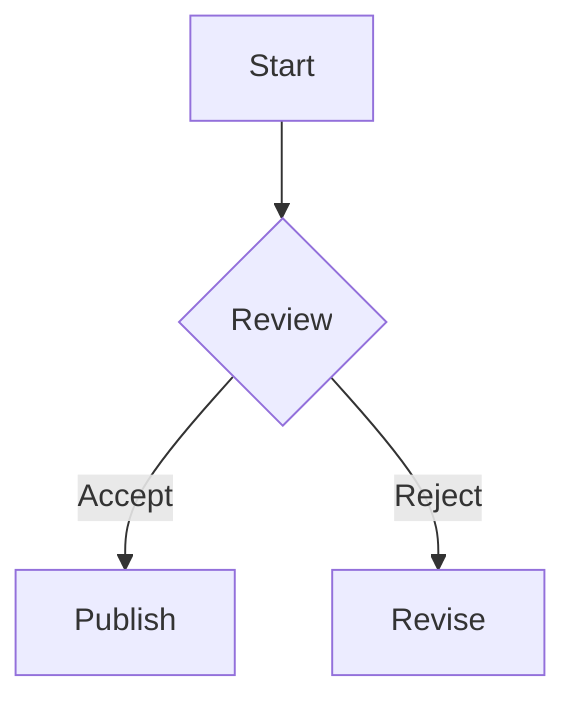
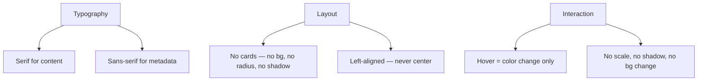

Every academic needs a homepage. Yet most of us either use outdated Jekyll templates that haven't aged well, or spend weeks wrestling with CSS. This post introduces a template that takes the opposite approach: **edit data files like filling out a form, get a professionally designed site for free.**

The live demo is my own page at [zhouzenghui.site](https://zhouzenghui.site). The source is at [github.com/MaxwelsDonc/MaxwelsDonc.github.io](https://github.com/MaxwelsDonc/MaxwelsDonc.github.io).

## What You Get



Three pages, one design language:

- **Home** — serif hero with your name, latest blog posts
- **About** — full academic CV with publications, education, honors
- **Blog** — editorial-style blog with KaTeX math and Mermaid diagrams

All styled in the **Editorial Minimalism** tradition — Newsreader serif fonts, generous whitespace, no card UI, no saturated colors. Inspired by Anthropic's engineering blog and _The New Yorker_.

## The Architecture

The key insight: **you never edit HTML or Astro components.** Instead, all your content lives in `src/data/` and `src/config.ts`:

```
src/
├── config.ts              # Name, social links, site URL — one file
├── data/
│   ├── intro.md           # About Me — free-form Markdown
│   ├── education.ts       # [{ date, title, school, description }]
│   ├── experience.ts      # [{ date, title, company, description }]
│   ├── news.ts            # [{ date, text, link? }]
│   ├── publications.ts    # Grouped paper list with venue + authors
│   ├── projects.ts        # [{ date, role, title, description }]
│   ├── honors.ts          # Grouped awards with level badges
│   ├── services.ts        # Reviewer, PC member, leadership roles
│   └── skills.ts          # ["Python", "PyTorch", ...]
└── content/
    └── blog/              # Markdown blog posts
```

Each `.ts` file exports a typed array. Your IDE provides autocomplete and catches mistakes before you even save. Here's what `education.ts` looks like:

```typescript
const education = [
  {
    date: "2020.09 – Present",
    title: "Ph.D. Candidate",
    school: "School of Automation, Beihang University",
    description: "Admitted to the Successive Master-Doctoral Program...",
  },
  {
    date: "2015.09 – 2019.06",
    title: "B.Eng.",
    school: "Shenyuan Honors College, Beihang University",
    description: "Top 1% elite institute...",
  },
];
```

## Quick Start

**Step 1: Fork and configure**

```bash
# Edit src/config.ts — change these fields:
export const site = {
  title: "Your Name",
  url: "https://yourname.github.io",
  analyticsId: "", // optional
};

export const author = {
  name: "Your Name (中文名)",
  email: "you@university.edu",
  github: "your-github",
  googleScholar: "...",
};
```

**Step 2: Replace the photo**

Swap `public/images/profile.jpg` with your headshot.

**Step 3: Edit your data files**

Each file in `src/data/` corresponds to a section on the About page. Open them, replace the example data with yours, and save. The format is self-documenting — every field has a clear name and TypeScript validates the structure.

**Step 4: Write a blog post (optional)**

````markdown
---
title: "My First Paper Accepted"
date: 2026-06-01
excerpt: "A short preview for the blog list."
featured: false
---

Content here. Supports **KaTeX**: $f(x) = \sum x^i / i!$

And **Mermaid** diagrams:


````

Math is rendered with KaTeX — `$E = mc^2$` for inline, `$$...$$` for display equations. Diagrams use Mermaid with ` ```mermaid ` code blocks. Both render client-side, no server required.

**Step 5: Push and deploy**

```bash
git add -A
git commit -m "Personalize my homepage"
git push origin main
```

GitHub Actions builds and deploys automatically. Within 60 seconds, your site is live.

## Configuration Reference

### Badge Variants

The About page uses four semantic badge types. Each maps to a specific data field:

| Badge | Color | Used In | Example |
|-------|-------|---------|---------|
| `journal` | Green | `publications.ts` → `venue` | TOSEM, TSE, KBS |
| `role` | Blue | `services.ts` → `role` | PC Member, Reviewer |
| `honor` | Amber | `honors.ts` → `level` | City-level, University |
| `project` | Purple | `projects.ts` → `role` | Algorithm Lead, Core Researcher |

### Publication Format

```typescript
{
  heading: "Manuscripts Under Review",
  papers: [
    {
      title: "Paper Title",
      venue: "TOSEM",                     // journal badge
      paperId: "USER_ID:XXXXXXXXXXXX",     // Google Scholar citation ID
      authors: "**Your Name**, Co-author", // **bold** = yourself
    },
  ],
}
```

### Google Scholar Citations

Citation counts are fetched from a CDN-backed JSON file, updated daily by a separate GitHub Action. To set it up:

1. Get your Google Scholar user ID (the `user=...` part of your profile URL)
2. Set `GOOGLE_SCHOLAR_ID` in your repo's Secrets
3. The crawler runs daily at UTC 08:00

Citation counts appear as small amber badges next to each paper.

## Design Principles

This template follows strict rules. If you're customizing, respect them:



1. **Binary font system** — Newsreader (serif) for names, titles, body; Inter (sans-serif) only for dates, labels, badges
2. **No cards** — no `background`, no `border-radius`, no `box-shadow` on content items
3. **5-level type scale** — 32px / 18px / 16px / 14px / 12px, each with a specific role
4. **Hover = color only** — no scale transforms, no shadow changes, no background transitions
5. **Full-width black lines** at section boundaries, not between individual items

## Common Issues

| Symptom | Cause | Fix |
|---------|-------|-----|
| Build fails with "Config validation failed" | Missing `site.title` or `author.name` | Fill in `src/config.ts` |
| Blog post not showing | `draft: true` in frontmatter | Set `draft: false` |
| Section looks wrong on About page | Removed `class="about-page"` | Don't remove it — it enables serif typography |
| Citation counts show "0" or nothing | Scholar crawler not configured | Set `GOOGLE_SCHOLAR_ID` secret and wait for next run |
| Mobile layout broken | Custom CSS added | Remove custom styling — the template handles responsiveness |

## Why This Approach

Most academic homepage templates are built on Jekyll or Hugo with complex Liquid/Go templating. They require understanding Ruby or Go toolchains, and customizing them means editing HTML/CSS directly.

This template's design bets on three observations:

1. **Academics know how to edit text files.** TypeScript arrays of objects are more intuitive than Liquid includes or Hugo shortcodes.
2. **Type safety prevents errors.** When you edit `education.ts`, your editor tells you exactly which fields are required and what types they expect.
3. **Deployment should be a push, not a ceremony.** GitHub Actions + Pages means zero-config hosting.

The template is MIT-licensed. Fork it, use it, modify it. If you build something cool, send me a link — I'd love to see what the community does with it.
